# 1.单机版一键部署 #

​&emsp;&emsp;本部分描述的单机版部署，所有服务均安装在同一台主机上，是在全新安装的主机上进行的，不建议在已有其它服务的主机上进行部署。由于部分环境内网无法访问，需要通过公网进行访问，则需要绑定公网IP，并且在启动部署脚本时会有些不同。

# 1.1 前期准备 #

## 主机配置要求 ##

| **项目** | **要求** | **备注**       |
| ------ | ------ | ------------ |
| CPU    | 4核以上   |              |
| 总内存    | 16G以上  |              |
| 磁盘     |        | 根据数据量、存储周期决定 |

​								表1 单机版主机配置要求

&emsp;&emsp;也可根据实际情况对主机配置进行调整，但不建议降低配置，主机安装系统(建议CentOS6.8)后，修改静态IP地址，下载单机版安装包，如果无法连接网络，请安装本地yum源。

## 1.2 一键部署 ##

​&emsp;&emsp;请选择空间较大的磁盘,创建目录并解压单机版的安装板

​&emsp;&emsp;这里以/sugo为例

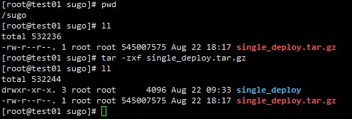

```
tar –zxf single_deploy.tar.gz
cd single_deploy/install
```

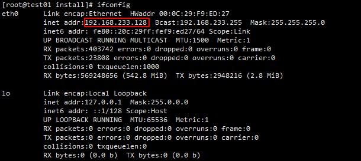

```
source single-deploy.sh –IP 192.168.233.128
```

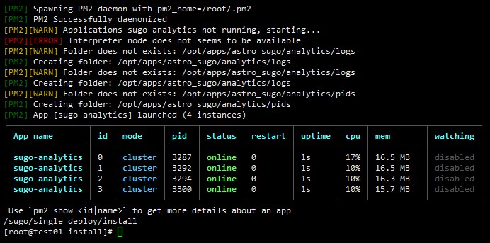

​&emsp;&emsp;此时，所有服务安装完成并启动，如果需要公网IP才能访问，请开放端口80、8000、8887和8090，如果不需要公网IP，可以直接访问，则无需设置端口转发。

​&emsp;&emsp;安装完成后因需要通过公网IP才能访问时，请开放端口，且将以下参数的IP地址修改为公网IP：


```
cd /opt/apps/astro_sugo/analytics
vim config.js
        collectGateway: 'http://192.168.0.122',
        sdk_ws_url: 'ws://192.168.0.122:8887',
        websdk_api_host: '192.168.0.122:8000'
修改上面三个参数,重启服务
cd /opt/apps/astro_sugo/analytics/
./cmds/stop
./cmds/run
```

## 1.3 环境测试 ##

### &emsp;&emsp;浏览器打开	http://192.168.233.128:8000	

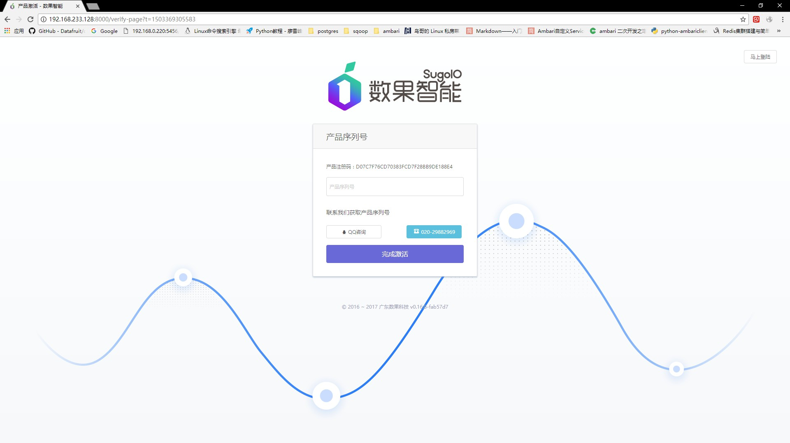


### &emsp;&emsp;复制产品注册码,联系sugo获取产品序列号


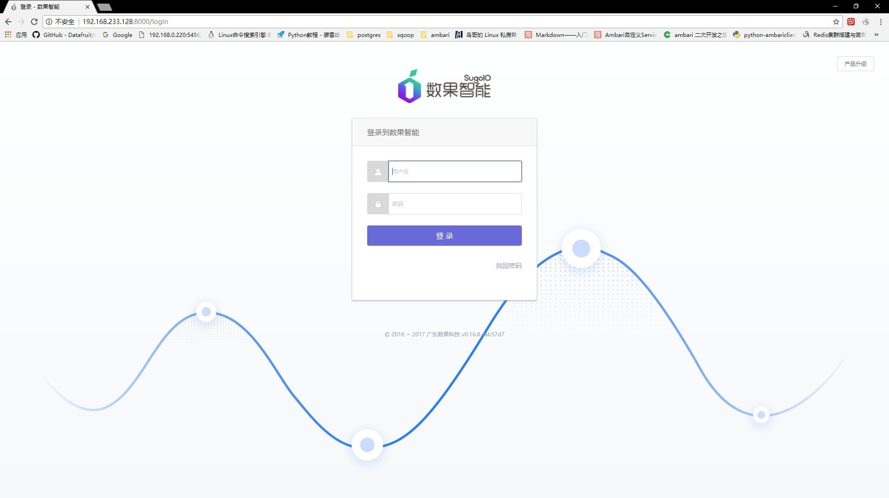


### &emsp;&emsp;用户名:admin

### &emsp;&emsp;密码:admin123456


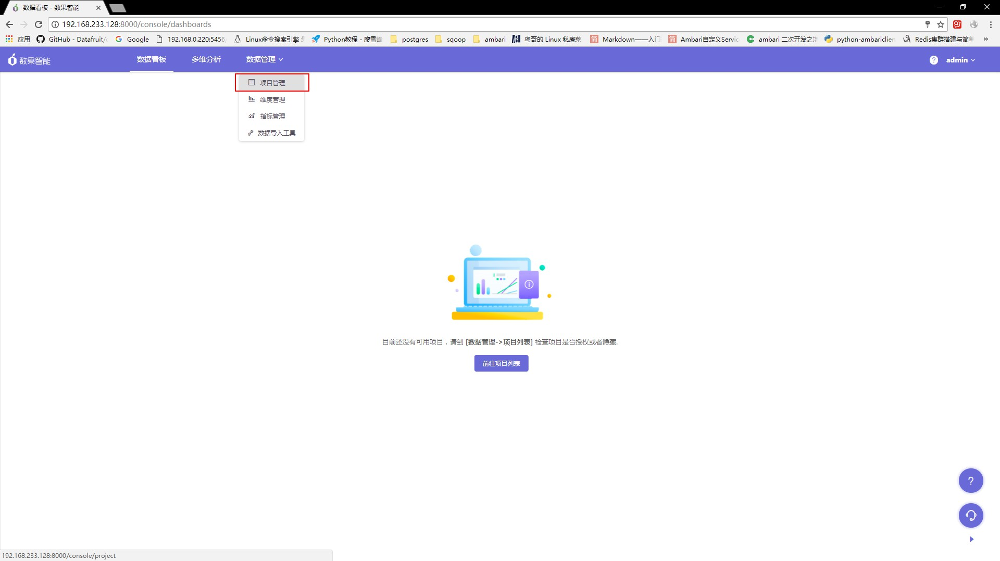

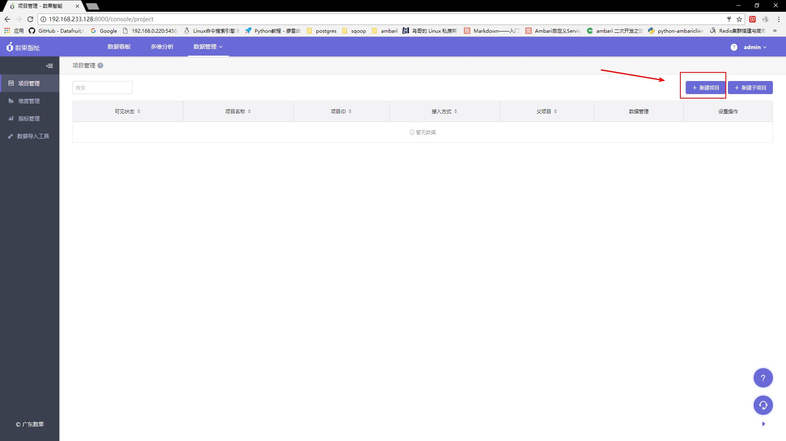

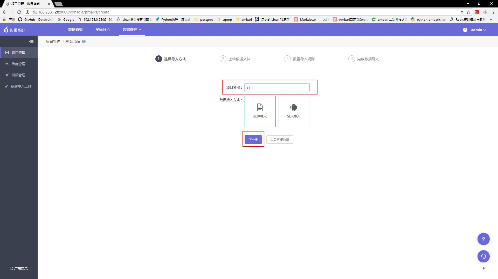

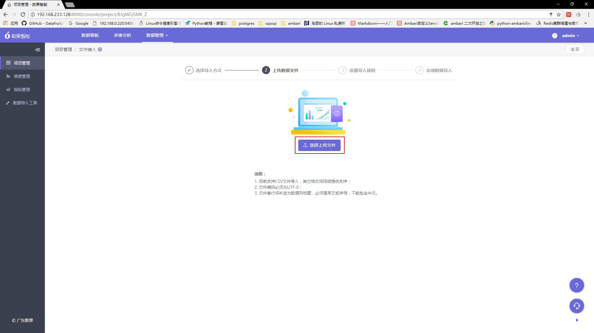


### &emsp;&emsp;联系sugo获取测试文件


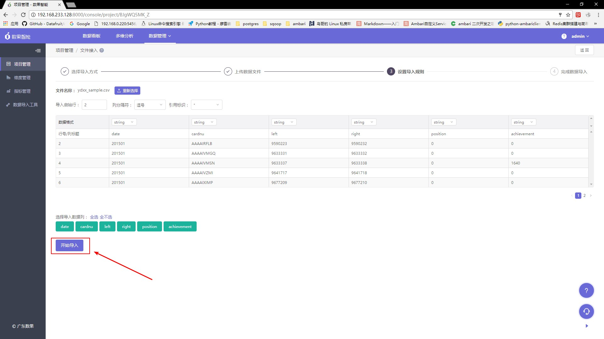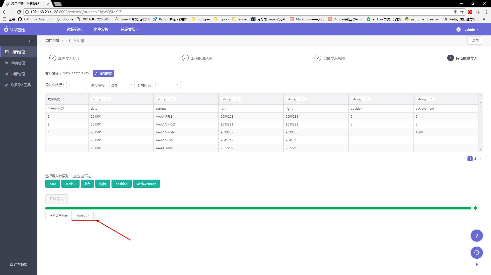


### &emsp;&emsp;等待一会大约15秒


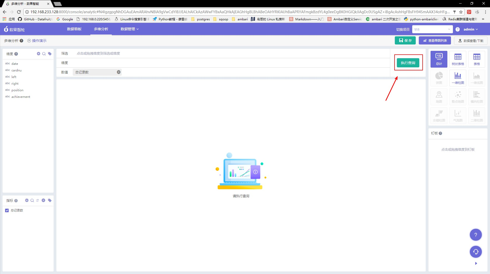
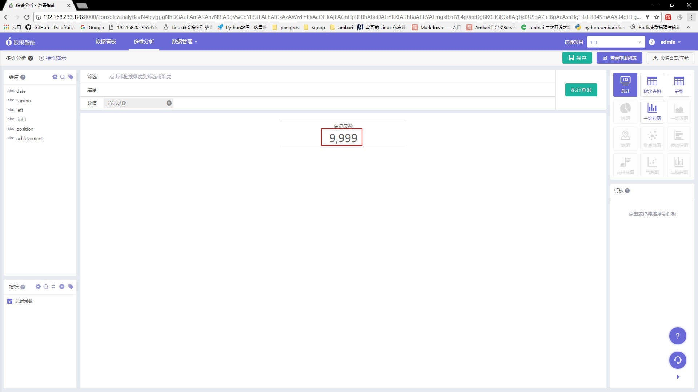


### &emsp;&emsp;查询出记录数即为成功!
